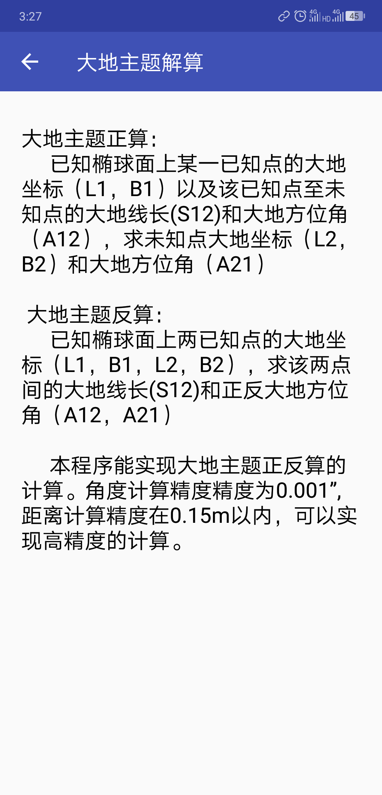

measure_app
===================

##### 2019毕业设计，基于Android Studio 平台的测量程序设计与实现

本程序基于Android Studio平台，采用Java编程语言进行开发，主要用于测量数据的处理。
程序包括附合导线近似平差计算、附合水准路线近似平差计算、坐标转换、大地主题正反算、
线路曲线要素计算等五个基础测量数据计算内容以及包括度分秒转换，方位角计算，坐标正
反算等测量数据处理工具。

程序说明
-------------------
用户点击图标进入应用，右侧菜单是测量工具箱，可以点击图标
进入或者右划拉出，主页面是五个测量程序的入口，点击对应的测量程序按钮进入相应的界
面，每一个测量程序均可以实现数据的输入、检查、计算、输出等功能。"

#### 1.主界面

|主界面|侧滑界面|
|---|---
|||


#### 2.测量工具箱


#### 3.五个测量程序
---------------------------
##### 1.附和导线近似平差计算
用户在进入程序后需要输入已知起算数据，包括已知点坐标和已知边方位角。若已知数据是四个坐标，
可以先用测量工具箱计算出方位角，再进行输入。之后对测量数据进行记录，包括测站，观测角，边长。
程序默认第一站不测量边长。输入完成后，点击下一站即可把数据存储入数据库中，注意只有下拉列表
出现数据，才表示数据存储成功，可以参与计算。如果输入错误可以点击重新测量。最后点击平差即可
以生成计算报告，包括角度闭合差，坐标增量闭合差在内的限差信息，还有测站数，导线全长信息以及
各点坐标和改正后的角度信息。角度计算精度为0.1”,坐标计算精度为0.001m。"

------

******
或者就是在两行文本直接加一个空行。

    开头加一个Tab是单行文本

`文字高亮`


|#|效果|
|---|---
|网络图片|[](http://www.baidu.com)|
|本地图片||
|本地图片||

|#|语法|效果|
|---|----|-----|
|2|`[我的博客]`|[我的博客](http://blog.csdn.net/guodongxiaren "悬停显示")|
* 123
    * 123
        * 123
> 数据结构
>> 树
>>> 二叉树
>>>> 平衡二叉树
>>>>> 满二叉树

### 代码效果
```Java
public class Caculate {
    public static double dmstohudu(double dms){//度.分秒数据化为弧度
        double d,m,s;
        int i = 1;
        if (dms < 0)
        {
            i = -1;
            dms = Math.abs(dms);
        }
        d = Math.floor(dms);//向下取整，返回不大于该数的最大整数，返回double类型
        m = Math.floor(100*(dms - d));
        s = 100 * (100 * (dms - d) - m);
        return i * (d + m / 60 + s / 3600)*Math.PI /180;
    } //Java
```


