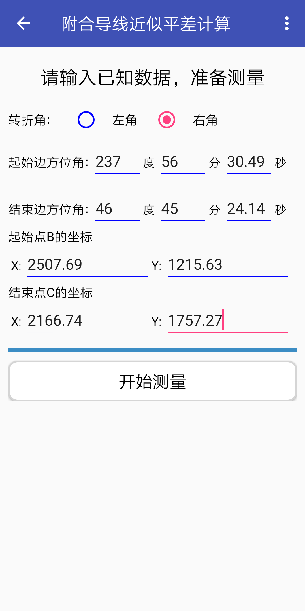
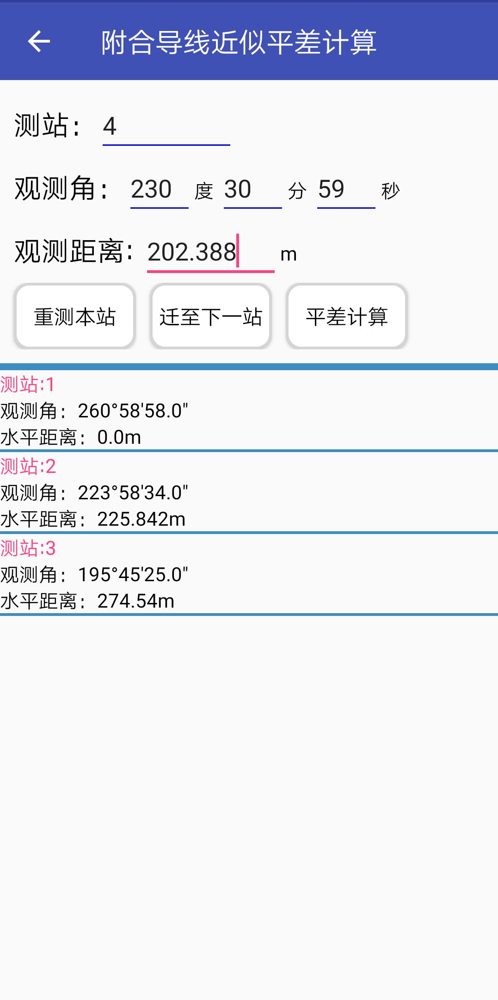
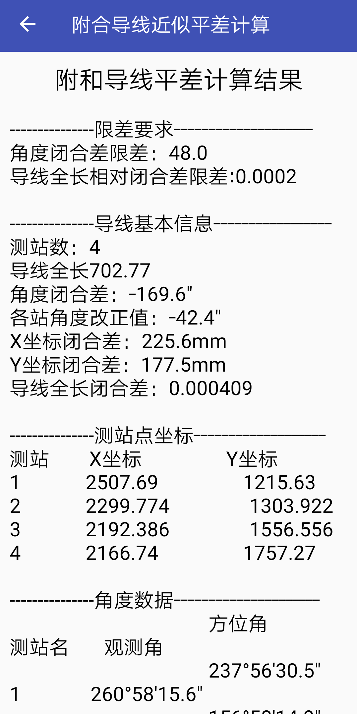

measure_app
===================

### 2019毕业设计，基于Android Studio 平台的测量程序设计与实现

本程序基于Android Studio平台，采用Java编程语言进行开发，主要用于测量数据的处理。
程序包括附合导线近似平差计算、附合水准路线近似平差计算、坐标转换、大地主题正反算、
线路曲线要素计算等五个基础测量数据计算内容以及包括度分秒转换，方位角计算，坐标正
反算等测量数据处理工具。

程序说明
-------------------
用户点击图标进入应用，右侧菜单是测量工具箱，可以点击图标
进入或者右划拉出，主页面是五个测量程序的入口，点击对应的测量程序按钮进入相应的界
面，每一个测量程序均可以实现数据的输入、检查、计算、输出等功能。（程序中角度显示方式是度.分秒，如 30°45′15.2″显示为30.45152）

#### 1.主界面
---------------------------
|主界面|侧滑界面|
|---|---
|
|
|

#### 2.测量工具箱
---------------------------
|方位角计算|坐标正算|
|---|---|
|
|
|

#### 3.五个测量程序
---------------------------
##### 1.附和导线近似平差计算

用户在进入程序后需要输入已知起算数据，包括已知点坐标和已知边方位角。若已知数据是四个坐标，
可以先用测量工具箱计算出方位角，再进行输入。之后对测量数据进行记录，包括测站，观测角，边长。
程序默认第一站不测量边长。输入完成后，点击下一站即可把数据存储入数据库中，注意只有下拉列表
出现数据，才表示数据存储成功，可以参与计算。如果输入错误可以点击重新测量。
最后点击平差即可以生成计算报告，包括角度闭合差，坐标增量闭合差在内的限差信息，还有测站数，
导线全长信息以及各点坐标和改正后的角度信息。角度计算精度为0.1”,坐标计算精度为0.001m。

`程序界面演示`

|起算数据|观测数据|计算报告|
|---|---|---
|
|
|
|

##### 2.水准路线计算

程序能实现二等和四等水准路线的测站检核和近似平差计算。
用户在进入程序后选择水准测量的等级，输入已知起算数据，包括起点高程和终点高程。
点击进行计算，之后可以对测站数据进行记录，包括测站名，尺常数，读数等。输入完
成后，点击“计算”即可查看本站的数据检核，如果出现红色表示该数据超限，用户可
以点击“重测”重新进行测量。若无超限数据，可以点击“迁至下一站”进行下一站的
测量，本站数据会存储到数据库。
测量完成后，点击“平差”即可以生成计算报告，包括水准路线的基本信息，限差信息，
还有各测站的距离，高差，改正数,以及各点平差后的高程。

`程序界面演示`

|起算数据|观测数据|
|:---:|:---:
|||
|**测站检核**|**平差报告**|
|||

##### 3.大地主题解算

大地主题正算：已知椭球面上某一已知点的大地坐标（L1，B1）以及该已知点至
未知点的大地线长(S12)和大地方位角（A12），求未知点大地坐标（L2，B2）和
大地方位角（A21）
大地主题反算：已知椭球面上两已知点的大地坐标（L1，B1，L2，B2），求该两
点间的大地线长(S12)和正反大地方位角（A12，A21）
程序能实现大地主题正反算的计算。角度显示方式是度.分秒，计算精度精度为0.001”,距离计算精度
在0.15m以内，可以实现高精度的计算。

`程序界面演示`

|大地主题正算|大地主题反算|
|---|---
|
|
|

##### 4.坐标转换

程序能实现测量时常用的单点坐标转换。
1. 由大地坐标计算大地空间直角坐标：已知某点的大地坐标（L，B，H），求该点相应的大地空间直角坐标（X，Y，Z）
2. 由大地空间直角坐标计算大地坐标：已知某点的大地空间直角坐标（X，Y，Z），求该点相应的大地坐标（L，B，H）
3. 高斯投影正算：已知椭球面上某点的大地坐标（L，B），求该点相应的高斯平面直角坐标（x，y）
4. 高斯投影反算：已知平面上某点的高斯平面直角坐标（x，y），求该点相应的椭球面上的大地坐标

程序角度计算精度精度为0.01”,距离计算精度在0.001m，可以实现高精度的转换。

`程序界面演示`

|选择转换方式|大地转直角坐标|高斯转大地坐标(高斯反算)|
|---|---|---
|
|
|
|

##### 5.线路曲线计算

程序能计算基本道路曲线的曲线要素和中桩及边桩的测设数据。
通过缓和曲线长控制曲线类型，当Ls1 = Ls2 = 0时，为圆曲线，当Ls1 = Ls2 = Ls时，是对称的缓和曲线，
当Ls1 != Ls2时，为不对称的缓和曲线。通过前缓直里程和交点里程控制直线段的长度。最后能实现各种
道路曲线类型的计算。计算结果可以复制粘贴,方便数据的导出。

`程序界面演示`

|输入界面|示例数据|计算报告|
|---|---|---
|
|
|
|

